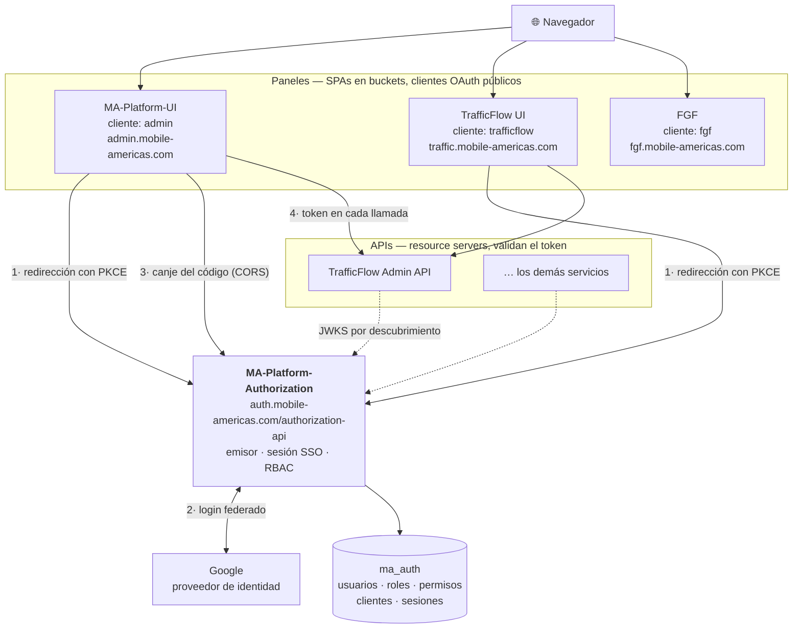

# Arquitectura de la autorización de la plataforma

Qué habla con qué, qué viaja dentro de un token, y las cosas que **no se ven
leyendo el código**.

> Este documento se revisa en la *pull request* que lo cambia. Si al leerlo
> encuentras algo que ya no es cierto, corrígelo en la misma rama donde lo
> descubriste: un documento que miente cuesta más que uno que falta.

**Última revisión:** 2026-09-20 · **Estado:** fase 2 en `develop`, sin desplegar.

---

## 1. La topología



**Las flechas continuas son el flujo; las punteadas, confianza.** Un resource
server nunca llama a auth para validar: descarga el JWKS una vez y verifica la
firma él mismo.

### Quién decide qué

| | decide |
|---|---|
| **Google** | quién eres |
| **auth** | si esa identidad existe en la plataforma, y qué puede hacer **en la aplicación que pide el token** |
| **cada API** | si el permiso que trae el token alcanza para la operación concreta |

Auth **no** sabe qué endpoints existen en TrafficFlow. TrafficFlow **no** sabe
quién dio de alta a nadie. El token es el único punto de contacto.

---

## 2. El flujo, paso a paso

```
1.  Sin sesión, el panel redirige el navegador a
    auth/oauth2/authorize?client_id=…&redirect_uri=…&code_challenge=…&state=…

2.  auth no sirve HTML: con un solo proveedor registrado, redirige a Google.

3.  Google devuelve al callback de auth. UsuarioOidcService comprueba que el
    correo esté verificado y dado de alta, y crea la sesión SSO.

4.  auth vuelve al panel con ?code=…&state=…

5.  El panel canjea el código:  POST auth/oauth2/token   ← cross-origin (CORS)
    Sin secreto de cliente: lo que prueba quién canjea es el code_verifier.

6.  El panel guarda los tokens EN MEMORIA y llama a su API con el access token.
```

**Al entrar en un segundo panel, los pasos 2 y 3 no ocurren**: la sesión SSO ya
existe y auth devuelve el código sin preguntar nada. Eso es el SSO.

### Renovar es una redirección, no una llamada

No hay refresh token: los clientes son públicos y un cliente público no lo
recibe. Cuando el access token caduca, el panel repite el paso 1 y vuelve con
uno nuevo sin que el usuario haga nada.

Por eso el TTL es de **2 horas** y no de 15 minutos: con renovación por
redirección, 15 minutos serían unos 32 parpadeos en una jornada.

---

## 3. Qué viaja dentro del token

Dos tokens, con dos trabajos distintos:

| | para qué | qué NO lleva |
|---|---|---|
| **ID token** | quién eres — lo consume la SPA | `roles` ni `permissions`: es un documento que el navegador puede guardar y que sobrevive horas a un cambio de rol |
| **Access token** | qué puedes — lo consume el resource server | nada que sirva para mostrar en pantalla |

**Lo que aísla una aplicación de otra es el `aud`**, que lleva el `client_id`. Un
token de `admin` no vale en `trafficflow` — pero sólo si el consumidor configura
`audiences`, porque **sin esa propiedad el `aud` no se comprueba**.

Dos reglas que se olvidan y no avisan cuando se olvidan:

- **`email` para mostrar, `uid` para guardar.** `sub` y `email` llevan el correo,
  y un correo es mutable: quien guarde cualquiera de los dos como clave ajena se
  queda con una referencia rota el día que alguien cambie de dirección, sin que
  nada falle. `uid` es `auth_user.id` y no cambia nunca.
- **Los permisos son `recurso:verbo`, con dos puntos**, ya expandidos y sin
  prefijo de aplicación. Los comodines nunca viajan.

> ### 📋 El contrato completo, claim a claim, está en el README
>
> **[README · Lo que trae el token](../README.md#lo-que-trae-el-token)** —
> ésa es la copia canónica, la que se actualiza cuando el contrato cambia.
>
> No se repite aquí a propósito: una tabla duplicada son dos cosas que deben
> concordar sin que nada las compare, que es exactamente la forma del bug que
> este servicio existe para no volver a tener. Si necesitas el detalle en otro
> documento, **enlaza** — un enlace que se queda viejo se ve; una tabla
> desincronizada, no.

## 4. Las aplicaciones registradas

| cliente | panel | API | catálogo |
|---|---|---|---|
| `admin` | MA-Platform-UI | — | 15 permisos |
| `fgf` | FGF | — | 6 permisos |
| `trafficflow` | TrafficFlow UI | Admin API | 26 permisos |

Todos **públicos**, con PKCE obligatorio y sin pantalla de consentimiento.

Dar de alta una aplicación son **dos cosas**, y olvidar la segunda produce el
fallo más caro de diagnosticar del servicio:

1. Su fila en `auth_app`, con `redirect_uris` — **por migración**, nunca a mano.
2. Su origen en `authorization.cors.allowed-origins`.

---

## 5. Las tres cosas que no se ven en el código

### 5.1 Una sola instancia no es una decisión de capacidad

**Es obligatorio.** No existe un almacén de autorizaciones compartido, así que
un código emitido por una instancia **no se puede canjear en otra**: subir el máximo
de instancias de Cloud Run (`terraform/servicio.tf`)
rompe el login de forma intermitente, con un `invalid_grant` que no señala a
ninguna parte.

Y el almacén en memoria **no purga nunca** las autorizaciones completas: crece
mientras la instancia vive. Con mínimo 0 (desde el 2026-10-03) Cloud Run la apaga al
quedarse sin uso y eso lo vacía; con mínimo 1 el síntoma sería un OOM semanas después,
y la sonda de vida reiniciaría la instancia borrando la evidencia.

`ReplicaUnicaTest` lo vigila y su mensaje dice qué hay que hacer antes de
subirlo. **No subas ese número sin leerlo.**

### 5.2 Un permiso con comodín no se puede recortar

`*:*` se expande contra **todo** el catálogo de la aplicación, y la concesión es
la **unión** de lo que dan los roles. No hay permisos negativos ni exclusiones.

Para que un rol con comodín **no** incluya un permiso concreto, hay que
renunciar al comodín y enumerar el resto — y entonces cada permiso nuevo hay que
acordarse de añadirlo, o aparece un endpoint que el administrador no puede usar
sin que nada lo explique.

**Consecuencia hoy:** quien administra TrafficFlow puede reenviar una
notificación de conversión. Reportar la misma conversión dos veces **se paga dos
veces**, y el pago es nuestro. Es una decisión tomada con la consecuencia
delante, no un efecto de cómo funciona el comodín, y está escrita en
`auth_role.description` para que la lea quien reparta roles.

### 5.3 Hay fallos que no dejan rastro en ningún log

Tres modos de fallo que **el servidor no ve**, y que por eso se persiguen en el
sitio equivocado:

| síntoma | causa | dónde mirar |
|---|---|---|
| La llamada al token no sale del navegador | el origen no está en CORS | consola del navegador |
| `redirect_uri_mismatch` | la URI no está en el cliente de Google — **lleva el context path** | consola de Google |
| Un consumidor acepta tokens de otra aplicación | falta `audiences` en su configuración | su `application.yml` |

Y uno más, del otro lado: **la ausencia de `error_reason` no significa nada**, a
propósito. Antes significaba «sin rol», y eso convierte *no mandar nada* en una
afirmación: una caída de red tampoco manda motivo, y heredaba ese significado.

---

## 6. Los entornos

| | local | producción |
|---|---|---|
| emisor | `http://localhost:18081/authorization-api` | `https://auth.mobile-americas.com/authorization-api` |
| base de datos | PostgreSQL local `ma_auth` | MySQL `ma_auth` |
| orígenes CORS | `localhost:5173`, `5174`, `3000` | los dominios de los paneles |
| clave de firma | `dev-keys/`, **excluida del JAR** | Secret de Kubernetes |

El emisor se **fija por configuración**; si se derivara de la petición, detrás
del ingress saldría el host del pod y todos los consumidores rechazarían los
tokens.

**Un único juego de migraciones** para los dos motores, con una excepción: la
tabla de atributos de sesión, que no tiene tipo común. Vive en
`db/migration-vendor/{vendor}/` — directorio **hermano**, porque Flyway escanea
`db/migration` recursivamente.

---

## 7. Dónde está cada cosa

| | |
|---|---|
| Decisiones con su porqué | `docs/superpowers/specs/` |
| Cómo se construyó, tarea a tarea | `docs/superpowers/plans/` |
| Guía para integrar un consumidor | `README.md` |
| Esta topología | este fichero |

Y el grafo de código indexado (MCP `codebase-memory`) tiene las mismas
decisiones en forma consultable, **sólo en la máquina de quien lo indexó**. Este
documento es el que viaja con el código.
